# AREA Worker System - Architecture Deep Dive

## System Architecture Overview

The AREA Worker System follows a distributed, event-driven architecture designed for scalability, fault tolerance, and loose coupling between components.

## High-Level Architecture


## Detailed Component Architecture

### 1. Message Flow Architecture


### 2. Data Flow Architecture


## Threading Model

### Worker Thread Pools

The system uses two distinct thread pools for optimal performance:

```java
// Worker Executor (Scheduled Tasks)
@Bean(name = "areaWorkerExecutor")
- Core Pool Size: 4 threads
- Max Pool Size: 10 threads  
- Queue Capacity: 100 tasks
- Keep Alive: 60 seconds

// Reaction Executor (Actual Executions)
@Bean(name = "reactionTaskExecutor")
- Core Pool Size: 2 threads
- Max Pool Size: 6 threads
- Queue Capacity: 50 tasks
- Keep Alive: 60 seconds
```

### Thread Allocation Strategy


## State Management

### Execution State Machine


### State Transitions

| From | To | Condition | Action |
|------|----|-----------| -------|
| QUEUED | RUNNING | Worker starts processing | Set `started_at` |
| RUNNING | OK | Execution succeeds | Set `finished_at`, `output_payload` |
| RUNNING | RETRY | Retryable error + attempts < 5 | Increment `attempt`, schedule retry |
| RUNNING | FAILED | Non-retryable error OR max attempts | Set `finished_at`, `error` |
| RETRY | RUNNING | Retry time reached | Update `started_at` |
| * | CANCELED | Manual cancellation | Set `finished_at`, `error` |

## Fault Tolerance Design

### 1. Retry Strategy

```mermaid
graph TB
    subgraph "Retry Decision Tree"
        START[Error Occurred]
        CHECK_ATTEMPTS{Attempts < 5?}
        CHECK_TYPE{Retryable Error?}
        CALC_DELAY[Calculate Backoff]
        SCHEDULE[Schedule Retry]
        FAIL[Mark as FAILED]
        
        START --> CHECK_ATTEMPTS
        CHECK_ATTEMPTS -->|No| FAIL
        CHECK_ATTEMPTS -->|Yes| CHECK_TYPE
        CHECK_TYPE -->|No| FAIL
        CHECK_TYPE -->|Yes| CALC_DELAY
        CALC_DELAY --> SCHEDULE
    end
    
    subgraph "Backoff Calculation"
        BASE[Base Delay: 2^attempt]
        JITTER[Add Jitter: ±10%]
        CAP[Cap at 300 seconds]
        
        BASE --> JITTER
        JITTER --> CAP
    end
```



### 2. Error Classification

```java
// Non-retryable errors (fail immediately)
- Authentication/Authorization errors
- Validation errors (400 Bad Request)
- Resource not found (404)
- IllegalArgumentException
- SecurityException

// Retryable errors (with backoff)
- Network timeouts
- Service unavailable (503)
- Rate limiting (429)
- Temporary server errors (5xx)
- RuntimeException (generic)
```

### 3. Circuit Breaker Pattern


## Scalability Patterns

### 1. Horizontal Scaling


### 2. Consumer Group Distribution


### 3. Database Sharding Strategy


## Performance Characteristics

### 1. Throughput Analysis

| Component | Typical Throughput | Bottleneck Factor |
|-----------|-------------------|-------------------|
| Redis Stream | 10,000+ ops/sec | Memory, Network |
| Worker Processing | 50-100 exec/sec/worker | External API calls |
| Database Writes | 1,000+ ops/sec | Disk I/O, Indexing |
| Reaction Execution | 1-10 exec/sec | Service latency |

### 2. Latency Breakdown


### 3. Memory Usage Pattern


## Security Architecture

### 1. Access Control


### 2. Data Protection


## Monitoring and Observability

### 1. Metrics Collection


### 2. Distributed Tracing


## Deployment Architecture

### 1. Container Deployment


### 2. Service Mesh Architecture


## Future Architecture Considerations

### 1. Event Sourcing


### 2. CQRS Implementation


---

This architecture documentation provides a comprehensive view of the AREA Worker System's design patterns, scalability considerations, and implementation details for future development and maintenance.