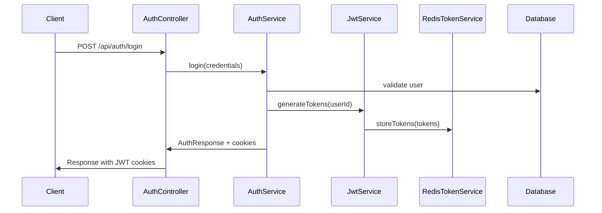
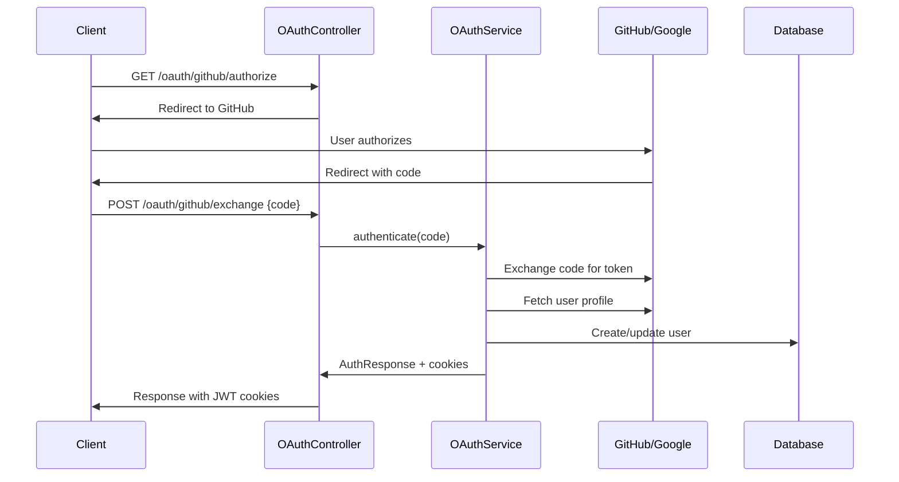

# Authentication & Authorization System

## Table of Contents
- [Overview](#overview)
- [Authentication Methods](#authentication-methods)
- [JWT Implementation](#jwt-implementation)
- [OAuth2 Integration](#oauth2-integration)
- [Authorization Model](#authorization-model)
- [Security Filters](#security-filters)
- [Token Management](#token-management)
- [Session Management](#session-management)

## Overview

The AREA backend implements a comprehensive authentication and authorization system supporting multiple authentication methods including local username/password authentication and OAuth2 social login providers.

## Authentication Methods

### 1. Local Authentication
**Implementation**: `AuthService.java`
- Email/password-based authentication
- BCrypt password hashing
- Account lockout after failed attempts
- Email verification support (future enhancement)

```java
@Service
public class AuthService {
    // Local login with email/password
    public AuthResponse login(LocalLoginRequest request, HttpServletResponse response)
    
    // User registration
    public AuthResponse register(RegisterRequest request, HttpServletResponse response)
    
    // Token refresh
    public AuthResponse refreshToken(String refreshToken, HttpServletResponse response)
}
```

### 2. OAuth2 Social Login
**Supported Providers**:
- GitHub (`OAuthGithubService.java`)
- Google (`OAuthGoogleService.java`)

**Implementation**: Abstract `OAuthService.java` base class

```java
public abstract class OAuthService {
    protected final String providerKey;     // "github", "google"
    protected final String clientId;
    protected final String clientSecret;
    
    // Abstract method for provider-specific authentication
    public abstract AuthResponse authenticate(OAuthLoginRequest request, HttpServletResponse response);
    
    // Common token cookie management
    protected void setTokenCookies(HttpServletResponse response, String accessToken, String refreshToken);
}
```

## JWT Implementation

### Token Types
The system uses two types of JWT tokens:

1. **Access Token**
   - Lifetime: 15 minutes (configurable)
   - Used for API authentication
   - Stored in HTTP-only cookie

2. **Refresh Token**
   - Lifetime: 7 days (configurable)
   - Used to obtain new access tokens
   - Stored in HTTP-only cookie

### JWT Service Implementation

```java
@Service
public class JwtService {
    // Token generation
    public String generateAccessToken(UUID userId)
    public String generateRefreshToken(UUID userId)
    
    // Token validation
    public boolean isAccessTokenValid(String token, UUID userId)
    public boolean isRefreshTokenValid(String token, UUID userId)
    
    // Claims extraction
    public UUID extractUserIdFromAccessToken(String token)
    public UUID extractUserIdFromRefreshToken(String token)
}
```

### Token Structure
```json
{
  "sub": "user-uuid",
  "iat": 1633024800,
  "exp": 1633025700,
  "type": "access_token"
}
```

## OAuth2 Integration

### GitHub OAuth Flow

1. **Authorization URL Generation**
   ```
   GET /api/oauth/github/authorize
   → Redirects to GitHub OAuth
   ```

2. **Token Exchange**
   ```
   POST /api/oauth/github/exchange
   {
     "code": "authorization_code_from_github"
   }
   ```

3. **User Data Retrieval**
   - Fetch user profile from GitHub API
   - Create or update user account
   - Generate JWT tokens
   - Set authentication cookies

### Google OAuth Flow
Similar to GitHub but with Google-specific endpoints and scopes.

### OAuth Configuration
```properties
# GitHub OAuth2 Configuration
spring.security.oauth2.client.registration.github.client-id=${GITHUB_CLIENT_ID}
spring.security.oauth2.client.registration.github.client-secret=${GITHUB_CLIENT_SECRET}

# Google OAuth2 Configuration
spring.security.oauth2.client.registration.google.client-id=${GOOGLE_CLIENT_ID}
spring.security.oauth2.client.registration.google.client-secret=${GOOGLE_CLIENT_SECRET}
```

## Authorization Model

### User Roles
The system implements a simple role-based access control:

- **Regular User**: Standard application access
- **Admin User**: Full system access (future enhancement)

### Permission Matrix
| Resource | Create | Read | Update | Delete | Admin Only |
|----------|--------|------|--------|--------|------------|
| Areas    | Own    | Own  | Own    | Own    | All        |
| Services | No     | All  | No     | No     | Yes        |
| Users    | Self   | Self | Self   | Self   | All        |

## Security Filters

### JWT Authentication Filter
**Class**: `JwtAuthenticationFilter.java`

```java
@Component
public class JwtAuthenticationFilter extends OncePerRequestFilter {
    @Override
    protected void doFilterInternal(HttpServletRequest request, 
                                   HttpServletResponse response, 
                                   FilterChain filterChain) {
        // 1. Extract JWT from cookies
        // 2. Validate token with Redis
        // 3. Verify JWT signature and claims
        // 4. Set Spring Security context
        // 5. Continue filter chain
    }
}
```

### Filter Chain Order
```
1. CorsFilter (Spring Security)
2. JwtAuthenticationFilter (Custom)
3. UsernamePasswordAuthenticationFilter (Spring Security)
4. ... other Spring Security filters
```

### Public Endpoints
No authentication required:
- `/api/auth/**` - Authentication endpoints
- `/api/oauth/**` - OAuth endpoints
- `/swagger-ui/**` - API documentation
- `/actuator/health` - Health checks
- `/api/about/**` - System information

## Token Management

### Redis Token Storage
**Service**: `RedisTokenService.java`

```java
@Service
public class RedisTokenService {
    // Store valid tokens
    public void storeAccessToken(String token, UUID userId, Duration expiry)
    public void storeRefreshToken(String token, UUID userId, Duration expiry)
    
    // Validate tokens
    public boolean isAccessTokenValid(String token)
    public boolean isRefreshTokenValid(String token)
    
    // Revoke tokens (logout)
    public void revokeAccessToken(String token)
    public void revokeRefreshToken(String token)
}
```

### Token Rotation
- Access tokens are rotated every 15 minutes
- Refresh tokens are rotated on each use (sliding window)
- Old tokens are blacklisted in Redis

### Token Security Features
- **HTTP-only cookies**: Prevent XSS attacks
- **Secure flag**: HTTPS-only in production
- **SameSite**: CSRF protection
- **Domain restriction**: Cookie scope limitation

## Session Management

### Cookie Configuration
**Class**: `JwtCookieProperties.java`

```java
@ConfigurationProperties(prefix = "app.jwt.cookie")
public class JwtCookieProperties {
    private boolean secure = false;           // HTTPS only
    private String sameSite = "Strict";       // CSRF protection
    private String domain;                    // Cookie domain
    private int accessTokenExpiry = 86400;   // 24 hours
    private int refreshTokenExpiry = 604800; // 7 days
}
```

### Environment-based Configuration
```properties
# Development
app.jwt.cookie.secure=false
app.jwt.cookie.same-site=Strict

# Production
app.jwt.cookie.secure=true
app.jwt.cookie.same-site=Strict
app.jwt.cookie.domain=yourdomain.com
```

## Security Best Practices

### Implemented
- ✅ JWT tokens in HTTP-only cookies
- ✅ Token rotation and blacklisting
- ✅ BCrypt password hashing
- ✅ CORS configuration
- ✅ Account lockout after failed attempts
- ✅ SQL injection prevention (JPA)
- ✅ Input validation

### Planned Enhancements
- 🔄 Rate limiting
- 🔄 Email verification
- 🔄 Two-factor authentication
- 🔄 Password complexity requirements
- 🔄 Audit logging

## Authentication Flow Diagrams

### Local Login Flow


### OAuth2 Flow


## API Endpoints

### Authentication Endpoints
```http
POST /api/auth/register
POST /api/auth/login
POST /api/auth/logout
POST /api/auth/refresh
GET  /api/auth/me
```

### OAuth Endpoints
```http
GET  /api/oauth/providers
GET  /api/oauth/{provider}/authorize
POST /api/oauth/{provider}/exchange
```

## Error Handling

### Authentication Errors
- `401 Unauthorized`: Invalid credentials
- `403 Forbidden`: Account locked
- `422 Unprocessable Entity`: Validation errors

### Token Errors
- `401 Unauthorized`: Invalid or expired token
- `403 Forbidden`: Token revoked or blacklisted

## Testing

### Unit Tests
- `AuthServiceTest.java`: Authentication logic
- `JwtServiceTest.java`: Token operations
- `OAuthServiceTest.java`: OAuth integration

### Integration Tests
- `AuthControllerTest.java`: API endpoint testing
- `SecurityConfigTest.java`: Security configuration

## Configuration Reference

### Required Environment Variables
```bash
# JWT Configuration
JWT_ACCESS_SECRET=your-access-token-secret
JWT_REFRESH_SECRET=your-refresh-token-secret

# OAuth2 Configuration
GITHUB_CLIENT_ID=your-github-client-id
GITHUB_CLIENT_SECRET=your-github-client-secret
GOOGLE_CLIENT_ID=your-google-client-id
GOOGLE_CLIENT_SECRET=your-google-client-secret

# Redis Configuration
REDIS_HOST=localhost
REDIS_PORT=6379
REDIS_PASSWORD=your-redis-password
```