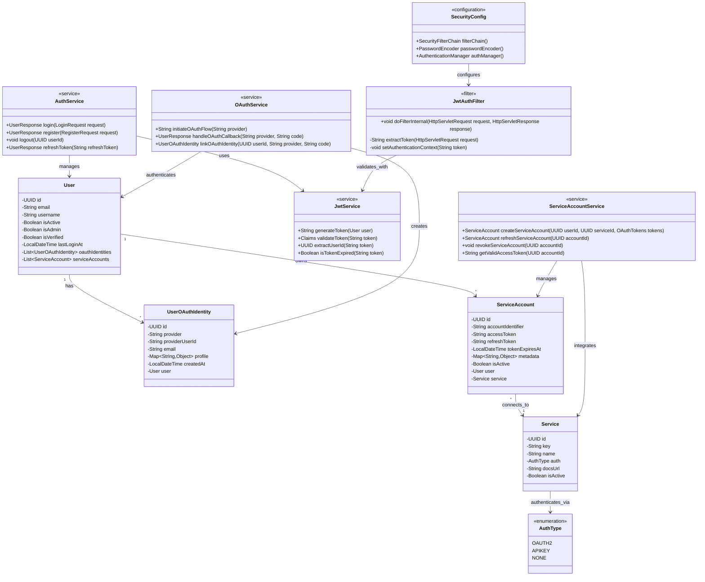

# Authentication System Class Diagram

This diagram focuses on the authentication and authorization components of the system.

## Component Descriptions

### Authentication Services

#### AuthService
Handles user authentication (login/register) and JWT token generation. Manages user sessions and token refresh.

#### OAuthService
Manages OAuth 2.0 flows for user authentication via external providers (Google, GitHub). Creates and links OAuth identities to users.

#### ServiceAccountService
Manages service-level OAuth credentials for accessing third-party APIs. Handles token refresh and revocation.

#### JwtService
Generates and validates JWT tokens for securing API endpoints. Extracts user claims and checks token expiration.

### Security Components

#### SecurityConfig
Spring Security configuration defining authentication rules, password encoding, and security filter chains.

#### JwtAuthFilter
Request filter that intercepts HTTP requests, extracts JWT tokens, validates them, and sets the security context.

### Data Models

#### UserOAuthIdentity
Stores OAuth credentials from external providers used for user login (Google, GitHub, etc.).

#### ServiceAccount
Stores OAuth credentials for third-party service integrations, allowing the system to act on behalf of users.

## Authentication Flow

1. **User Login**: User provides credentials → AuthService validates → JwtService generates token
2. **OAuth Login**: User redirects to provider → OAuthService handles callback → Creates/links UserOAuthIdentity
3. **API Request**: JwtAuthFilter intercepts → JwtService validates token → Sets authentication context
4. **Service Integration**: User authorizes service → ServiceAccountService creates ServiceAccount → Stores tokens
5. **Token Refresh**: ServiceAccountService checks expiration → Refreshes tokens automatically

## Security Features

- JWT-based stateless authentication
- OAuth 2.0 integration for user login
- Separate service accounts for API integrations
- Token refresh mechanism
- Role-based access control (isAdmin flag)
- Account verification system (isVerified flag)
