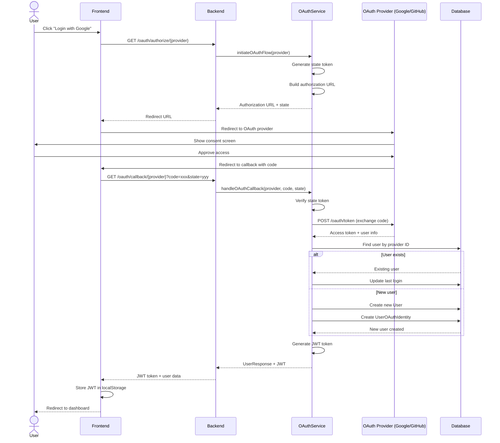
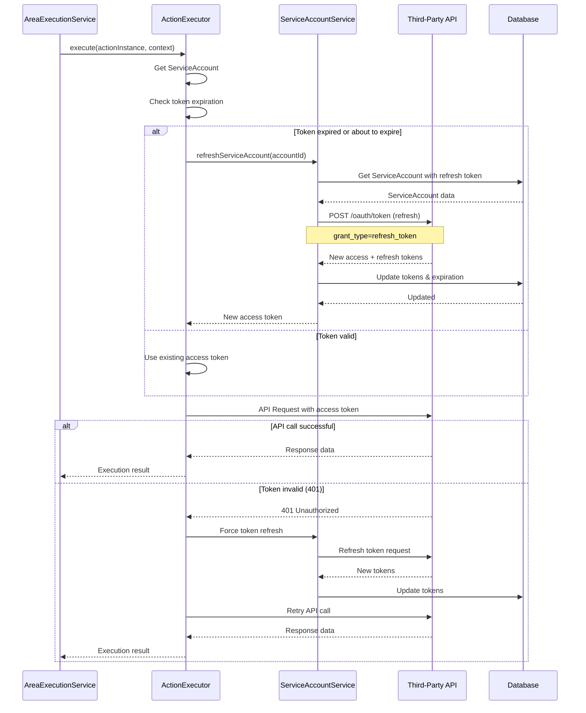

# OAuth Authentication Flow - Sequence Diagram

This diagram shows the complete OAuth 2.0 authentication flow for user login and service integration.

## User Authentication with OAuth

## Service Account Connection (OAuth for Third-Party Services)

```mermaid
sequenceDiagram
    actor User
    participant Frontend
    participant Backend
    participant ServiceAccountService
    participant OAuthService
    participant Provider as Third-Party Service (GitHub/Slack)
    participant Database

    User->>Frontend: Connect GitHub service
    Frontend->>Backend: POST /services/{serviceId}/connect
    Backend->>Backend: Verify JWT & get userId
    Backend->>OAuthService: initiateOAuthFlow("github", scopes)
    OAuthService->>OAuthService: Generate state with userId + serviceId
    OAuthService-->>Backend: Authorization URL
    Backend-->>Frontend: Authorization URL
    Frontend->>Provider: Redirect to GitHub OAuth
    Provider->>User: Show permissions screen
    User->>Provider: Approve permissions
    Provider->>Frontend: Redirect with code
    
    Frontend->>Backend: GET /oauth/callback/service/github?code=xxx&state=yyy
    Backend->>OAuthService: handleServiceOAuthCallback(code, state)
    OAuthService->>OAuthService: Decode state (userId, serviceId)
    
    OAuthService->>Provider: POST /oauth/token (exchange code)
    Provider-->>OAuthService: Access + Refresh tokens
    
    OAuthService->>Provider: GET /user (get account info)
    Provider-->>OAuthService: User account details
    
    OAuthService->>ServiceAccountService: createServiceAccount(tokens, accountInfo)
    ServiceAccountService->>Database: Check existing account
    
    alt Account exists
        Database-->>ServiceAccountService: Existing ServiceAccount
        ServiceAccountService->>Database: Update tokens & metadata
    else New account
        ServiceAccountService->>Database: Create new ServiceAccount
        Database-->>ServiceAccountService: ServiceAccount created
    end
    
    ServiceAccountService-->>Backend: ServiceAccount details
    Backend-->>Frontend: Connection successful
    Frontend-->>User: Show "GitHub connected" ✓
```

## Token Refresh Flow

## Key Points

### User OAuth Flow
1. State token prevents CSRF attacks
2. User approves permissions on provider site
3. Code is exchanged for access token server-side
4. User account is created or linked with OAuth identity
5. JWT token is generated for session management

### Service Account OAuth Flow
1. State includes userId and serviceId for context
2. Scopes request specific permissions needed for actions
3. Both access and refresh tokens are stored
4. Account identifier links to provider account
5. Tokens are automatically refreshed when expired

### Security Considerations
- State tokens prevent CSRF attacks
- Authorization codes are single-use
- Access tokens have limited lifetime
- Refresh tokens enable automatic renewal
- All OAuth operations are server-side to protect secrets
