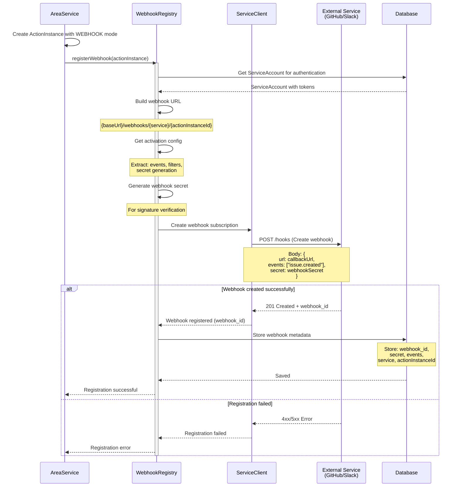
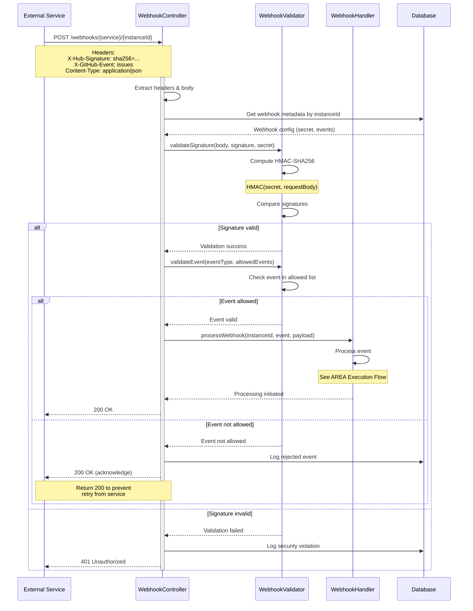
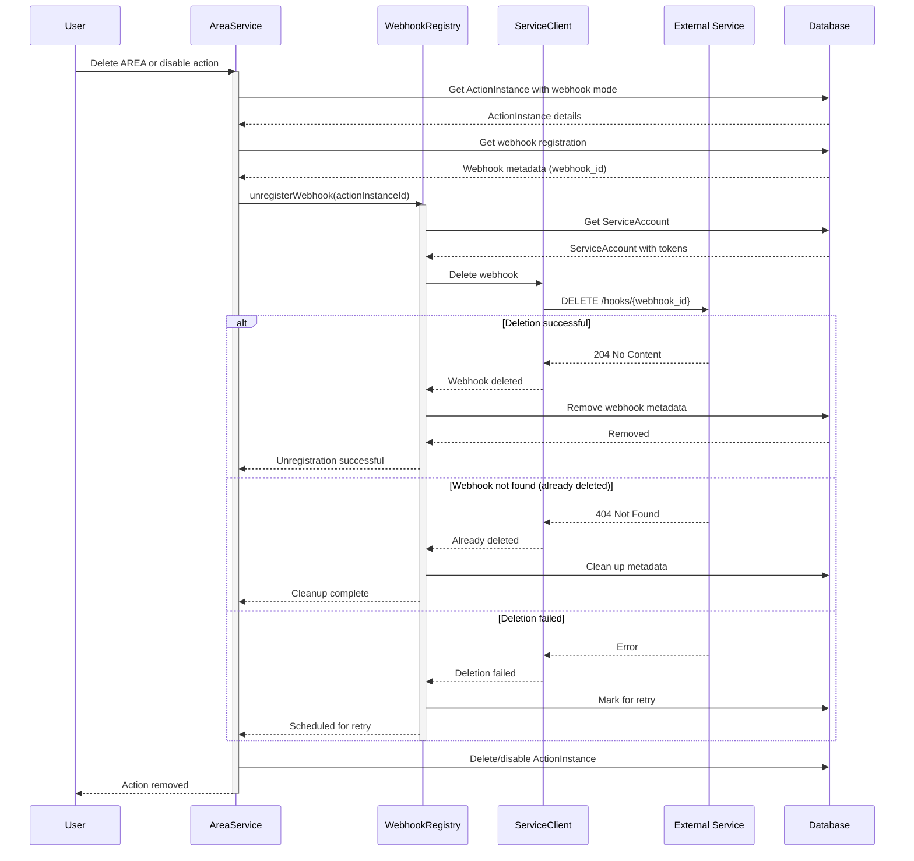
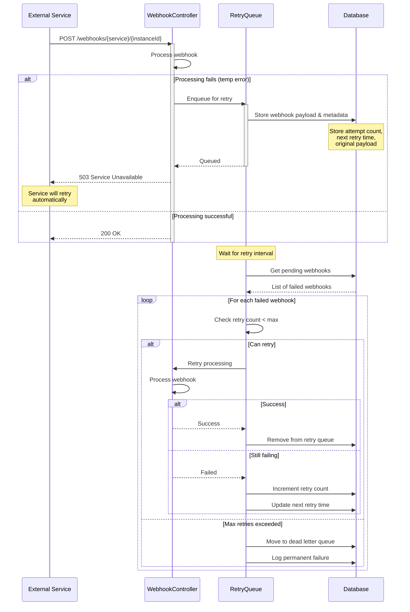

# Webhook System - Sequence Diagram

This diagram shows webhook registration, event reception, and processing.

## Webhook Registration Flow



## Webhook Event Reception and Validation



## Webhook Deregistration Flow



## Webhook Retry Mechanism



## Service-Specific Webhook Configurations

### GitHub Webhooks
```json
{
  "events": ["push", "pull_request", "issues"],
  "contentType": "application/json",
  "signatureHeader": "X-Hub-Signature-256",
  "eventHeader": "X-GitHub-Event",
  "deliveryHeader": "X-GitHub-Delivery"
}
```

### Slack Webhooks
```json
{
  "events": ["message.channels", "app_mention"],
  "contentType": "application/json",
  "signatureHeader": "X-Slack-Signature",
  "timestampHeader": "X-Slack-Request-Timestamp",
  "verificationToken": true
}
```

## Security Features

1. **Signature Verification**: HMAC-SHA256 validation
2. **Event Filtering**: Only process allowed event types
3. **Rate Limiting**: Prevent webhook flooding
4. **Secret Rotation**: Periodic webhook secret updates
5. **IP Whitelisting**: Accept webhooks only from known IPs
6. **Replay Protection**: Timestamp validation for Slack

## Error Handling

- **Invalid Signature**: Return 401, log security event
- **Unknown Event**: Return 200, log and ignore
- **Processing Error**: Return 503, queue for retry
- **Missing ActionInstance**: Return 404, clean up webhook
- **Disabled AREA**: Return 200, skip processing
