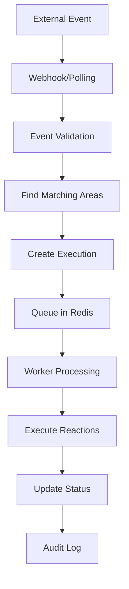

# Area Management System

## Table of Contents
- [Overview](#overview)
- [Core Concepts](#core-concepts)
- [Entity Model](#entity-model)
- [Area Creation Flow](#area-creation-flow)
- [JSON Schema Validation](#json-schema-validation)
- [Action & Reaction System](#action--reaction-system)
- [Execution Engine](#execution-engine)
- [Background Workers](#background-workers)
- [API Reference](#api-reference)

## Overview

The Area Management System is the core component of the AREA platform that allows users to create, configure, and manage automation workflows. Each "Area" represents an automation that connects triggers (actions) with responses (reactions).

## Core Concepts

### Area (Automation)
An Area is a user-defined automation workflow consisting of:
- **Actions**: Triggers that initiate the automation (webhooks, polling, schedules)
- **Reactions**: Responses executed when actions are triggered
- **Links**: Data mapping between actions and reactions
- **Activation Mode**: How the automation is triggered (cron, webhook, polling)

### Action vs Reaction
- **Action**: Event-capable components that can trigger automations
- **Reaction**: Executable components that perform operations
- **Action Definition**: Template defining available actions/reactions
- **Action Instance**: Configured instance of an action definition

## Entity Model

### Area Entity
```java
@Entity
@Table(name = "a_areas", schema = "area")
public class Area {
    @Id
    private UUID id;
    
    @ManyToOne
    private User user;                    // Owner of the area
    
    private String name;                  // User-defined name
    private String description;           // Optional description
    private Boolean enabled;              // Active/inactive state
    
    @JdbcTypeCode(SqlTypes.JSON)
    private List<Map<String, Object>> actions;    // JSONB actions config
    
    @JdbcTypeCode(SqlTypes.JSON)
    private List<Map<String, Object>> reactions;  // JSONB reactions config
    
    private LocalDateTime createdAt;
    private LocalDateTime updatedAt;
}
```

### Action Definition Entity
```java
@Entity
@Table(name = "a_action_definitions", schema = "area")
public class ActionDefinition {
    @Id
    private UUID id;
    
    private String key;                   // Unique identifier
    private String name;                  // Display name
    private String description;           // Description
    private String serviceKey;            // Associated service
    
    private Boolean isEventCapable;       // Can be used as trigger
    private Boolean isExecutable;         // Can be used as reaction
    
    @JdbcTypeCode(SqlTypes.JSON)
    private Map<String, Object> inputSchema;     // JSON schema for parameters
    
    @JdbcTypeCode(SqlTypes.JSON)
    private Map<String, Object> outputSchema;    // JSON schema for output data
}
```

### Action Instance Entity
```java
@Entity
@Table(name = "a_action_instances", schema = "area")
public class ActionInstance {
    @Id
    private UUID id;
    
    @ManyToOne
    private Area area;                    // Parent area
    
    @ManyToOne
    private ActionDefinition actionDefinition;  // Template
    
    @ManyToOne
    private ServiceAccount serviceAccount;       // Authentication
    
    @JdbcTypeCode(SqlTypes.JSON)
    private Map<String, Object> parameters;     // Instance configuration
    
    @Enumerated(EnumType.STRING)
    private ActivationModeType activationMode;  // CRON, WEBHOOK, POLL
    
    private String cronExpression;        // For scheduled actions
    private Boolean enabled;
}
```

## Area Creation Flow

### 1. Basic Area Creation
```java
// Simple area creation (backward compatibility)
POST /api/areas
{
    "name": "My Simple Area",
    "description": "Basic area",
    "userId": "user-uuid"
}
```

### 2. Advanced Area Creation with Actions
```java
// Area with complete action/reaction configuration
POST /api/areas/with-actions
{
    "name": "GitHub to Slack Integration",
    "description": "Send Slack notification when GitHub issue is created",
    "userId": "user-uuid",
    "actions": [
        {
            "actionDefinitionId": "github-issue-created-uuid",
            "serviceAccountId": "github-account-uuid",
            "parameters": {
                "repository": "owner/repo",
                "event_types": ["opened", "reopened"]
            }
        }
    ],
    "reactions": [
        {
            "actionDefinitionId": "slack-send-message-uuid", 
            "serviceAccountId": "slack-account-uuid",
            "parameters": {
                "channel": "#notifications",
                "template": "New issue: {{issue.title}}"
            }
        }
    ]
}
```

### 3. Area Creation with Links
```java
// Area with data mapping between actions and reactions
POST /api/areas/with-actions-and-links
{
    "name": "Complex GitHub Integration",
    "userId": "user-uuid",
    "actions": [...],
    "reactions": [...],
    "links": [
        {
            "sourceActionIndex": 0,
            "targetReactionIndex": 0,
            "dataMapping": {
                "issue.title": "message.title",
                "issue.url": "message.url",
                "issue.author": "message.author"
            }
        }
    ]
}
```

## JSON Schema Validation

### Schema Validation Service
```java
@Service
public class JsonSchemaValidationService {
    
    /**
     * Validates parameters against action definition schema
     */
    public void validateParameters(Map<String, Object> schema, 
                                 Map<String, Object> parameters) {
        // 1. Parse JSON schema
        // 2. Validate parameter structure
        // 3. Check required fields
        // 4. Validate data types
        // 5. Throw detailed validation errors
    }
}
```

### Example Action Definition Schema
```json
{
    "type": "object",
    "properties": {
        "repository": {
            "type": "string",
            "pattern": "^[a-zA-Z0-9_-]+/[a-zA-Z0-9_-]+$",
            "description": "GitHub repository in format owner/repo"
        },
        "event_types": {
            "type": "array",
            "items": {
                "type": "string",
                "enum": ["opened", "closed", "reopened", "edited"]
            },
            "minItems": 1,
            "description": "Issue events to monitor"
        }
    },
    "required": ["repository"],
    "additionalProperties": false
}
```

### Validation Flow
```java
@Service
public class AreaService {
    
    private void validateActionsAndReactions(List<AreaActionRequest> actions, 
                                           List<AreaReactionRequest> reactions) {
        for (AreaActionRequest action : actions) {
            ActionDefinition actionDef = actionDefinitionRepository
                .findById(action.getActionDefinitionId())
                .orElseThrow(() -> new IllegalArgumentException("Action definition not found"));
            
            // Validate action is event-capable (can be trigger)
            if (!actionDef.getIsEventCapable()) {
                throw new IllegalArgumentException("Action must be event capable");
            }
            
            // Validate parameters against schema
            jsonSchemaValidationService.validateParameters(
                actionDef.getInputSchema(), 
                action.getParameters()
            );
        }
        
        // Similar validation for reactions
    }
}
```

## Action & Reaction System

### Action Definitions Registry
The system maintains a registry of available actions and reactions:

```java
// GitHub Service Actions
github-issue-created      (Event Capable)
github-pull-request-opened (Event Capable)
github-repository-starred  (Event Capable)

// GitHub Service Reactions  
github-create-issue       (Executable)
github-comment-issue      (Executable)
github-close-issue        (Executable)

// Slack Service Reactions
slack-send-message        (Executable)
slack-create-channel      (Executable)
```

### Dynamic Action Loading
Actions are loaded from the database and can be added dynamically:

```sql
INSERT INTO area.a_action_definitions (
    key, name, description, service_key,
    is_event_capable, is_executable,
    input_schema, output_schema
) VALUES (
    'github-issue-created',
    'GitHub Issue Created',
    'Triggered when a new issue is created',
    'github',
    true, false,
    '{"type": "object", "properties": {...}}',
    '{"type": "object", "properties": {...}}'
);
```

## Execution Engine

### Execution Flow


### Execution Entity
```java
@Entity
@Table(name = "a_executions", schema = "area")
public class Execution {
    @Id
    private UUID id;
    
    @ManyToOne
    private Area area;                    // Associated area
    
    @ManyToOne
    private ActionInstance triggerAction; // Triggering action
    
    @JdbcTypeCode(SqlTypes.JSON)
    private Map<String, Object> inputData;       // Trigger data
    
    @JdbcTypeCode(SqlTypes.JSON)
    private Map<String, Object> outputData;      // Execution results
    
    @Enumerated(EnumType.STRING)
    private ExecutionStatus status;       // QUEUED, RUNNING, OK, FAILED
    
    private LocalDateTime triggeredAt;
    private LocalDateTime completedAt;
    private String errorMessage;
}
```

### Execution Service
```java
@Service
public class ExecutionService {
    
    /**
     * Creates a new execution for an area
     */
    public Execution createExecution(Area area, 
                                   ActionInstance triggerAction,
                                   Map<String, Object> inputData) {
        Execution execution = new Execution();
        execution.setArea(area);
        execution.setTriggerAction(triggerAction);
        execution.setInputData(inputData);
        execution.setStatus(ExecutionStatus.QUEUED);
        execution.setTriggeredAt(LocalDateTime.now());
        
        return executionRepository.save(execution);
    }
    
    /**
     * Updates execution status and results
     */
    public void updateExecution(UUID executionId, 
                              ExecutionStatus status,
                              Map<String, Object> outputData,
                              String errorMessage) {
        // Update execution with results
    }
}
```

## Background Workers

### Area Reaction Worker
```java
@Component
public class AreaReactionWorker {
    
    /**
     * Processes events from Redis stream
     */
    @Scheduled(fixedDelay = 1000)
    @Async("areaWorkerExecutor")
    public void processAreaEvents() {
        // 1. Read from Redis stream
        // 2. Process event records
        // 3. Create executions
        // 4. Queue reactions
    }
    
    /**
     * Processes queued executions
     */
    @Scheduled(fixedDelay = 5000)
    @Async("areaWorkerExecutor")
    public void processQueuedExecutions() {
        List<Execution> queued = executionService.getQueuedExecutions();
        for (Execution execution : queued) {
            processExecution(execution);
        }
    }
}
```

### Reaction Executor
```java
@Component
public class ReactionExecutor {
    
    /**
     * Executes a single reaction with retry logic
     */
    public ExecutionResult executeReaction(ActionInstance reactionInstance,
                                         Map<String, Object> inputData) {
        try {
            // 1. Validate reaction parameters
            // 2. Prepare service authentication
            // 3. Execute reaction logic
            // 4. Return execution result
        } catch (Exception e) {
            // Handle errors and retry logic
        }
    }
}
```

### Retry Management
```java
@Component
public class RetryManager {
    
    private static final int MAX_RETRIES = 3;
    private static final int RETRY_DELAY_SECONDS = 60;
    
    /**
     * Handles execution retries with exponential backoff
     */
    public void handleRetry(Execution execution, Exception error) {
        if (execution.getRetryCount() < MAX_RETRIES) {
            // Schedule retry with delay
            scheduleRetry(execution, calculateRetryDelay(execution.getRetryCount()));
        } else {
            // Mark as permanently failed
            execution.setStatus(ExecutionStatus.FAILED);
            execution.setErrorMessage(error.getMessage());
        }
    }
}
```

## Data Mapping & Links

### Action Links
```java
@Entity
@Table(name = "a_action_links", schema = "area")
public class ActionLink {
    @Id
    private UUID id;
    
    @ManyToOne
    private Area area;
    
    @ManyToOne  
    private ActionInstance sourceAction;   // Data source
    
    @ManyToOne
    private ActionInstance targetReaction; // Data destination
    
    @JdbcTypeCode(SqlTypes.JSON)
    private Map<String, String> dataMapping;  // Field mapping rules
    
    @Enumerated(EnumType.STRING)
    private LinkType linkType;            // DIRECT, CONDITIONAL
}
```

### Data Mapping Service
```java
@Service
public class DataMappingService {
    
    /**
     * Maps data from action output to reaction input
     */
    public Map<String, Object> mapActionDataToReaction(
            Map<String, Object> sourceData,
            Map<String, String> mappingRules) {
        
        Map<String, Object> mappedData = new HashMap<>();
        
        for (Map.Entry<String, String> mapping : mappingRules.entrySet()) {
            String sourcePath = mapping.getKey();     // "issue.title"
            String targetPath = mapping.getValue();   // "message.title"
            
            Object value = extractValueByPath(sourceData, sourcePath);
            setValueByPath(mappedData, targetPath, value);
        }
        
        return mappedData;
    }
}
```

## API Reference

### Area Management Endpoints

#### Create Basic Area
```http
POST /api/areas
Content-Type: application/json

{
    "name": "My Area",
    "description": "Area description",
    "userId": "user-uuid"
}
```

#### Create Area with Actions
```http
POST /api/areas/with-actions
Content-Type: application/json

{
    "name": "GitHub Integration",
    "description": "GitHub to Slack integration",
    "userId": "user-uuid",
    "actions": [
        {
            "actionDefinitionId": "action-def-uuid",
            "serviceAccountId": "service-account-uuid",
            "parameters": {
                "repository": "owner/repo"
            }
        }
    ],
    "reactions": [
        {
            "actionDefinitionId": "reaction-def-uuid",
            "serviceAccountId": "service-account-uuid", 
            "parameters": {
                "channel": "#notifications"
            }
        }
    ]
}
```

#### Get User Areas
```http
GET /api/areas/user/{userId}?page=0&size=20&sortBy=createdAt&sortDir=desc
```

#### Get Area Details
```http
GET /api/areas/{areaId}
```

#### Update Area
```http
PUT /api/areas/{areaId}
Content-Type: application/json

{
    "name": "Updated Area Name",
    "description": "Updated description",
    "enabled": true
}
```

#### Delete Area
```http
DELETE /api/areas/{areaId}
```

### Action Instance Management

#### Create Action Instance
```http
POST /api/action-instances
Content-Type: application/json

{
    "areaId": "area-uuid",
    "actionDefinitionId": "action-def-uuid",
    "serviceAccountId": "service-account-uuid",
    "parameters": {
        "repository": "owner/repo"
    }
}
```

#### Get Action Instances
```http
GET /api/action-instances/area/{areaId}
```

### Execution Management

#### Get Area Executions  
```http
GET /api/executions/area/{areaId}?status=OK&limit=50
```

#### Get Execution Details
```http
GET /api/executions/{executionId}
```

## Error Handling

### Validation Errors
```json
{
    "error": "VALIDATION_ERROR",
    "message": "Invalid action parameters",
    "details": {
        "field": "repository",
        "message": "Repository format must be owner/repo",
        "rejectedValue": "invalid-repo"
    }
}
```

### Execution Errors
```json
{
    "error": "EXECUTION_ERROR", 
    "message": "Failed to execute reaction",
    "details": {
        "reactionId": "reaction-uuid",
        "errorCode": "SERVICE_UNAVAILABLE",
        "retryable": true
    }
}
```

## Performance Considerations

### Database Optimization
- JSONB columns with GIN indexes for efficient querying
- Pagination for large result sets
- Connection pooling with HikariCP
- Query optimization with JPA criteria

### Caching Strategy
- Action definitions cached in Redis
- Service configurations cached
- User permissions cached
- Execution results cached (limited time)

### Scalability
- Async processing with Redis streams
- Horizontal scaling of worker processes
- Database read replicas for queries
- Rate limiting for API endpoints

## Monitoring & Observability

### Metrics Collection
- Area creation/execution rates
- Success/failure ratios
- Response times
- Worker queue sizes

### Health Checks
- Database connectivity
- Redis connectivity  
- External service availability
- Worker process health

### Logging
- Structured logging with correlation IDs
- Execution audit trails
- Error tracking and alerting
- Performance monitoring