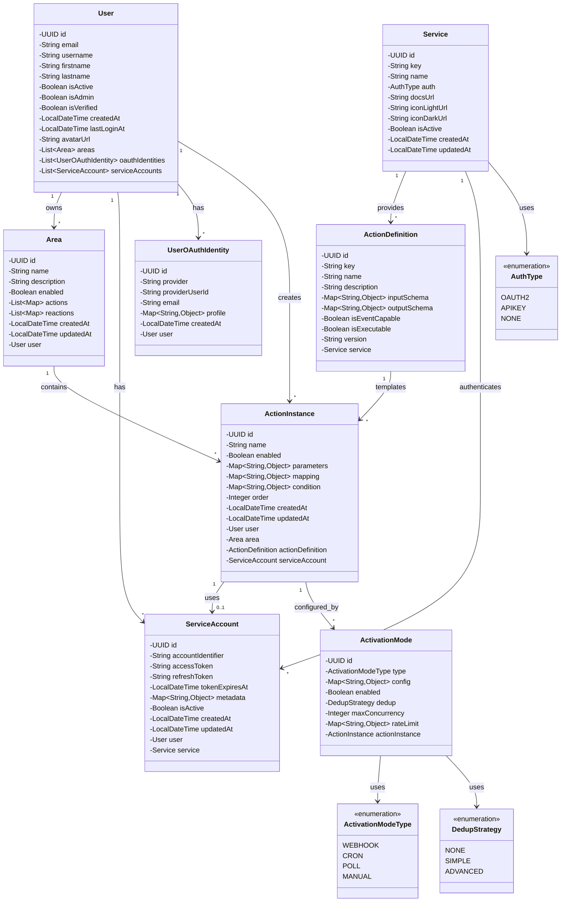

# Core Entities Class Diagram

This diagram shows the core entity model of the AREA system, focusing on the main domain objects and their relationships.

## Entity Descriptions

### User
The main user entity representing an authenticated user in the system. Can own multiple Areas and service connections.

### Area
Represents an automation workflow created by a user. Contains actions (triggers) and reactions (responses) stored as JSONB.

### Service
Third-party service integration (e.g., GitHub, Gmail, Slack). Defines how the service authenticates and what actions it provides.

### ActionDefinition
Template for an action or reaction. Defines the input/output schema and whether it can be used as a trigger or response.

### ActionInstance
Concrete instance of an ActionDefinition within an Area. Contains user-specific parameters and configuration.

### ServiceAccount
OAuth credentials linking a User to a Service, allowing authenticated API calls.

### ActivationMode
Defines how an ActionInstance should be triggered (webhook, cron schedule, polling).

### UserOAuthIdentity
OAuth identity from external providers (Google, GitHub) for user authentication.

## Key Relationships

- **User owns Areas**: One user can create multiple automation workflows
- **Area contains ActionInstances**: Each automation workflow has multiple action and reaction instances
- **Service provides ActionDefinitions**: Each service defines what actions/reactions are available
- **ActionInstance uses ServiceAccount**: Actions need authentication to access external APIs
- **ActionInstance configured by ActivationMode**: Defines trigger mechanism (webhook, cron, poll)
