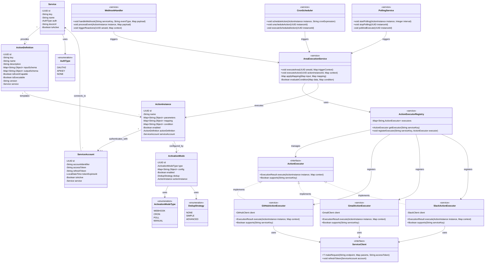

# Service Integration Architecture Class Diagram

This diagram shows how external services are integrated and how actions/reactions are executed.



## Component Descriptions

### Service Integration Layer

#### ActionExecutor (Interface)
Defines the contract for executing actions on external services. Each service has its own implementation.

#### Service-Specific Executors
- **GitHubActionExecutor**: Handles GitHub API calls (create issue, star repo, etc.)
- **GmailActionExecutor**: Manages Gmail operations (send email, search emails)
- **SlackActionExecutor**: Handles Slack integrations (post message, create channel)

#### ActionExecutorRegistry
Central registry that maps service keys to their corresponding executors. Enables dynamic executor discovery.

#### ServiceClient (Interface)
Abstraction for making HTTP requests to external APIs with OAuth token management.

### Execution Orchestration

#### AreaExecutionService
Main orchestrator for AREA execution. Handles the flow from trigger to reactions, applies data mapping and conditions.

#### WebhookHandler
Receives and processes webhook events from external services, triggering appropriate AREAs.

#### CronScheduler
Manages scheduled action execution based on cron expressions (e.g., "every day at 9 AM").

#### PollingService
Periodically polls external services for changes when webhooks aren't available.

### Data Models

#### Service
Represents a third-party integration with authentication configuration.

#### ActionDefinition
Template defining what an action can do, its inputs, and outputs.

#### ActionInstance
User-configured instance of an action with specific parameters.

#### ActivationMode
Defines how an action is triggered (webhook, cron, poll, manual).

#### ServiceAccount
OAuth credentials for accessing external service APIs.

## Execution Flow

### 1. Webhook-Triggered Execution
```
External Service → Webhook → WebhookHandler → AreaExecutionService → ActionExecutor
```

### 2. Cron-Scheduled Execution
```
CronScheduler → AreaExecutionService → ActionExecutor
```

### 3. Polling-Based Execution
```
PollingService → AreaExecutionService → ActionExecutor
```

### 4. Manual Execution
```
User Request → AreaExecutionService → ActionExecutor
```

## Key Features

- **Pluggable Architecture**: New services can be added by implementing ActionExecutor
- **Multiple Activation Modes**: Supports webhooks, cron, polling, and manual triggers
- **Data Mapping**: Transform trigger output to match reaction input schema
- **Conditional Execution**: Evaluate conditions before executing reactions
- **Token Management**: Automatic OAuth token refresh
- **Deduplication**: Prevent duplicate executions of the same event
