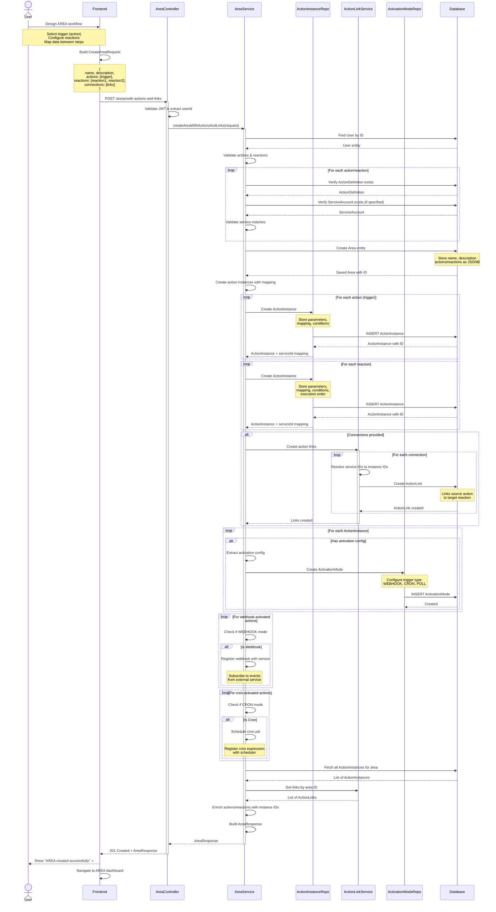

# AREA Creation Flow - Sequence Diagram

This diagram shows the complete process of creating an automation workflow (AREA) with actions, reactions, and links.



## Request Structure Example

```json
{
  "userId": "550e8400-e29b-41d4-a716-446655440000",
  "name": "GitHub to Slack Notifier",
  "description": "Send Slack message when GitHub issue is created",
  "actions": [
    {
      "actionDefinitionId": "github-issue-created-def-id",
      "name": "GitHub Issue Trigger",
      "serviceAccountId": "github-account-id",
      "parameters": {
        "repository": "user/repo"
      },
      "activationConfig": {
        "type": "WEBHOOK",
        "config": {
          "events": ["issues.opened"]
        }
      }
    }
  ],
  "reactions": [
    {
      "actionDefinitionId": "slack-send-message-def-id",
      "name": "Send Slack Alert",
      "serviceAccountId": "slack-account-id",
      "parameters": {
        "channel": "#alerts"
      },
      "mapping": {
        "message": "{{trigger.issue.title}} - {{trigger.issue.url}}"
      },
      "order": 1
    }
  ],
  "connections": [
    {
      "sourceServiceId": "action-0",
      "targetServiceId": "reaction-0"
    }
  ]
}
```

## Key Processes

### 1. Validation Phase
- Verify user exists and is active
- Validate all ActionDefinitions exist
- Verify ServiceAccounts belong to user and match services
- Ensure proper action/reaction configuration

### 2. Entity Creation
- Create Area entity with JSONB actions/reactions
- Create ActionInstance for each action and reaction
- Store parameters, mappings, and conditions
- Assign execution order to reactions

### 3. Link Establishment
- Resolve temporary service IDs to actual ActionInstance IDs
- Create ActionLink entities connecting triggers to reactions
- Enable data flow between actions

### 4. Activation Setup
- Parse activation configuration
- Create ActivationMode entities
- Register webhooks with external services
- Schedule cron jobs for periodic triggers
- Start polling services if needed

### 5. Response Building
- Enrich JSONB data with ActionInstance IDs
- Include all created links
- Return complete AREA configuration

## Data Mapping

The system supports sophisticated data mapping using JSON path expressions:

```json
{
  "mapping": {
    "message": "New issue: {{trigger.issue.title}}",
    "url": "{{trigger.issue.html_url}}",
    "author": "{{trigger.issue.user.login}}"
  }
}
```

## Conditional Execution

Reactions can have conditions evaluated before execution:

```json
{
  "condition": {
    "operator": "AND",
    "rules": [
      {
        "field": "{{trigger.issue.labels}}",
        "operator": "contains",
        "value": "bug"
      },
      {
        "field": "{{trigger.issue.state}}",
        "operator": "equals",
        "value": "open"
      }
    ]
  }
}
```
