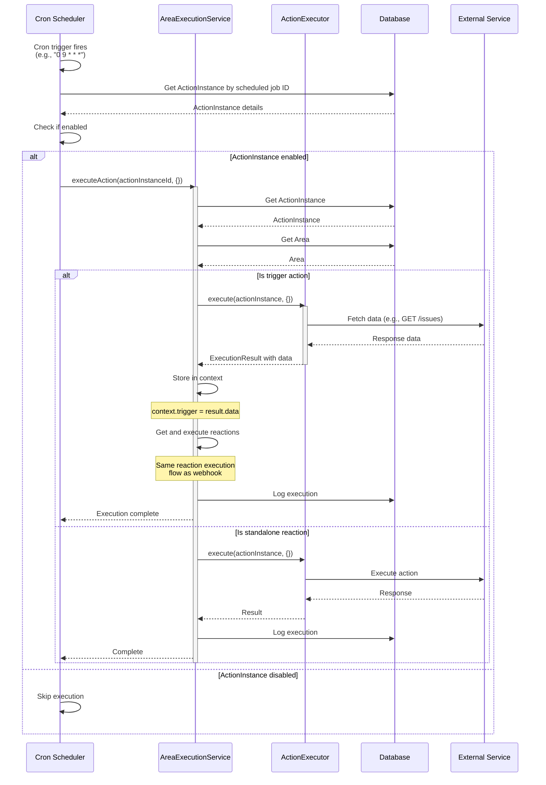
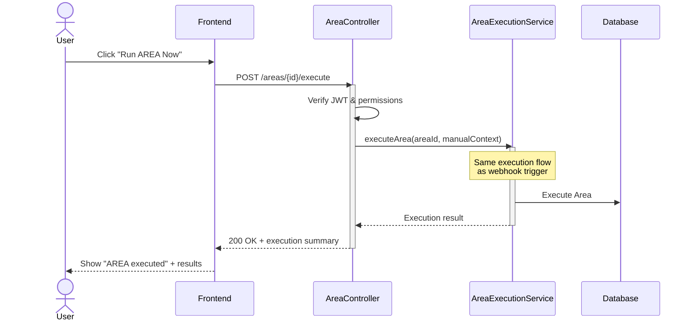

# AREA Execution Flow - Sequence Diagram

This diagram shows how an AREA is triggered and executed, from event detection to reaction completion.

## Webhook-Triggered Execution

```mermaid
sequenceDiagram
    participant External as External Service<br/>(GitHub)
    participant WebhookController
    participant WebhookHandler
    participant AreaExecutionService
    participant ActionExecutor
    participant Database
    participant TargetAPI as Target Service<br/>(Slack)

    External->>WebhookController: POST /webhooks/github<br/>{event: "issue.created", payload: {...}}
    activate WebhookController
    WebhookController->>WebhookController: Verify webhook signature
    WebhookController->>WebhookHandler: handleWebhook(serviceKey, eventType, payload)
    activate WebhookHandler

    %% Find matching action instances
    WebhookHandler->>Database: Find ActionInstances<br/>WHERE service="github"<br/>AND activationMode.type=WEBHOOK<br/>AND enabled=true
    Database-->>WebhookHandler: List of matching ActionInstances

    loop For each matching ActionInstance
        WebhookHandler->>WebhookHandler: Check event type matches config
        alt Event matches
            WebhookHandler->>WebhookHandler: Apply deduplication check
            alt Not duplicate
                WebhookHandler->>AreaExecutionService: executeArea(areaId, triggerContext)
                activate AreaExecutionService

                %% Get Area details
                AreaExecutionService->>Database: Get Area by ID
                Database-->>AreaExecutionService: Area with actions/reactions

                AreaExecutionService->>Database: Get all ActionInstances for Area
                Database-->>AreaExecutionService: List of ActionInstances

                AreaExecutionService->>Database: Get ActionLinks for Area
                Database-->>AreaExecutionService: Execution graph (links)

                %% Build execution context
                AreaExecutionService->>AreaExecutionService: Initialize execution context
                Note over AreaExecutionService: context = {<br/>  trigger: webhookPayload,<br/>  area: {...},<br/>  variables: {}<br/>}

                %% Execute reactions in order
                AreaExecutionService->>AreaExecutionService: Get reactions ordered by 'order' field
                
                loop For each Reaction (in order)
                    AreaExecutionService->>AreaExecutionService: Apply data mapping
                    Note over AreaExecutionService: Transform trigger data<br/>using mapping rules

                    AreaExecutionService->>AreaExecutionService: Evaluate conditions
                    Note over AreaExecutionService: Check if condition<br/>expression is true

                    alt Condition met
                        AreaExecutionService->>AreaExecutionService: Get ActionExecutor for service
                        AreaExecutionService->>ActionExecutor: execute(actionInstance, context)

                        %% Get and validate token
                        ActionExecutor->>Database: Get ServiceAccount
                        Database-->>ActionExecutor: ServiceAccount with tokens

                        ActionExecutor->>ActionExecutor: Check token expiration
                        alt Token expired
                            ActionExecutor->>External: POST /oauth/token (refresh)
                            External-->>ActionExecutor: New access token
                            ActionExecutor->>Database: Update tokens
                        end

                        %% Execute action
                        ActionExecutor->>TargetAPI: API Call (e.g., POST /chat.postMessage)
                        Note over ActionExecutor,TargetAPI: Headers: Authorization: Bearer {token}<br/>Body: mapped parameters

                        alt API call successful
                            TargetAPI-->>ActionExecutor: 200 OK + response data
                            ActionExecutor->>ActionExecutor: Build execution result
                            ActionExecutor->>Database: Log execution (success)
                            ActionExecutor-->>AreaExecutionService: ExecutionResult (success, data)

                            AreaExecutionService->>AreaExecutionService: Store result in context
                            Note over AreaExecutionService: context.variables[reactionId] = result
                        else API call failed
                            TargetAPI-->>ActionExecutor: 4xx/5xx Error
                            ActionExecutor->>Database: Log execution (failure)
                            ActionExecutor-->>AreaExecutionService: ExecutionResult (failure, error)
                            
                            alt Critical reaction
                                AreaExecutionService->>AreaExecutionService: Abort execution
                                AreaExecutionService->>Database: Log area execution (failed)
                                AreaExecutionService-->>WebhookHandler: Execution failed
                            else Non-critical
                                AreaExecutionService->>AreaExecutionService: Continue to next reaction
                            end
                        end
                    else Condition not met
                        AreaExecutionService->>AreaExecutionService: Skip reaction
                        AreaExecutionService->>Database: Log skipped execution
                    end
                end

                %% Complete execution
                AreaExecutionService->>Database: Log area execution (success)
                AreaExecutionService->>Database: Update Area.lastRun timestamp
                AreaExecutionService-->>WebhookHandler: Execution completed
                deactivate AreaExecutionService
            else Duplicate event
                WebhookHandler->>WebhookHandler: Skip execution (dedup)
                WebhookHandler->>Database: Log duplicate event
            end
        end
    end

    WebhookHandler-->>WebhookController: Webhook processed
    deactivate WebhookHandler
    WebhookController-->>External: 200 OK
    deactivate WebhookController
```



## Cron-Scheduled Execution



## Manual Execution



## Key Execution Features

### 1. Deduplication
Prevents duplicate execution of the same event:
- **SIMPLE**: Hash-based dedup using event payload
- **ADVANCED**: Custom dedup logic per service
- **NONE**: No deduplication

### 2. Data Mapping
Transform trigger output to reaction input:
```javascript
// Template mapping
"message": "Issue #{{trigger.issue.number}}: {{trigger.issue.title}}"

// Result
"message": "Issue #123: Fix login bug"
```

### 3. Conditional Execution
Reactions only run if conditions are met:
```json
{
  "operator": "AND",
  "rules": [
    {"field": "{{trigger.priority}}", "operator": ">=", "value": 5},
    {"field": "{{trigger.status}}", "operator": "equals", "value": "open"}
  ]
}
```

### 4. Error Handling
- Failed reactions can halt or continue execution
- Detailed error logging for debugging
- Automatic token refresh on authentication errors
- Retry logic for transient failures

### 5. Execution Context
Maintains state throughout execution:
```json
{
  "trigger": { /* webhook payload or cron result */ },
  "area": { /* area configuration */ },
  "variables": {
    "reaction-1-id": { /* first reaction output */ },
    "reaction-2-id": { /* second reaction output */ }
  },
  "metadata": {
    "executionId": "uuid",
    "startTime": "timestamp",
    "triggeredBy": "webhook|cron|manual"
  }
}
```

### 6. Execution Order
Reactions execute sequentially based on `order` field, allowing:
- Multi-step workflows
- Data passing between reactions
- Dependent actions
